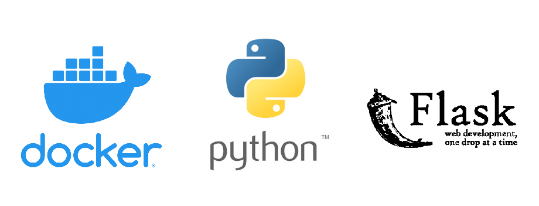

# SDS project

SDS is a tool to detect and implement security best practices over docker containers. 
The gaol of this application is scan docker containers looking for potential security issues
by highlighting corrections needed to take into account as well as providing best practices 
for hardening your containers environment.

## Built With 🛠️

* [Docker SDK](https://docker-py.readthedocs.io/en/stable/) - Docker SDK for Python
* [Python](https://www.python.org/) - Python
* [Flask](https://www.fullstackpython.com/flask.html) - Python web framework

## Contributing 🖇️

Please read [CONTRIBUTING.md](CONTRIBUTING.md) for details on our code of conduct, and the process for submitting pull requests to us.

## Versioning 📌

This project adheres to [Semantic Versioning](https://semver.org/spec/v2.0.0.html).

## Change Log 📌

[CHANGELOG.md](CHANGELOG.md) for details

## Author ✒️

* **David López Beltrán** - *Initial work* - [dlpezbel](https://github.com/dlpezbel)

## License 📄

The code in this repository, including all code samples in the notebooks listed above, 
is released under the MIT license. Read more at the [LICENSE.md](LICENSE.md) for details.

